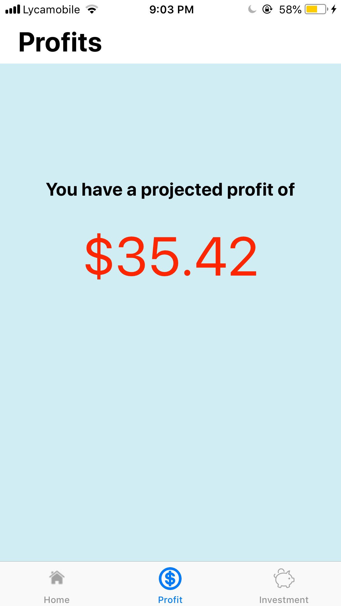
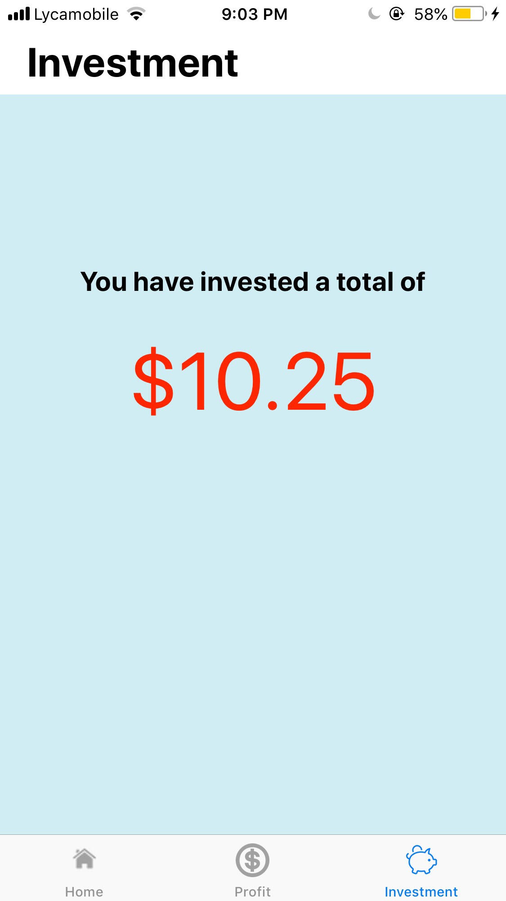
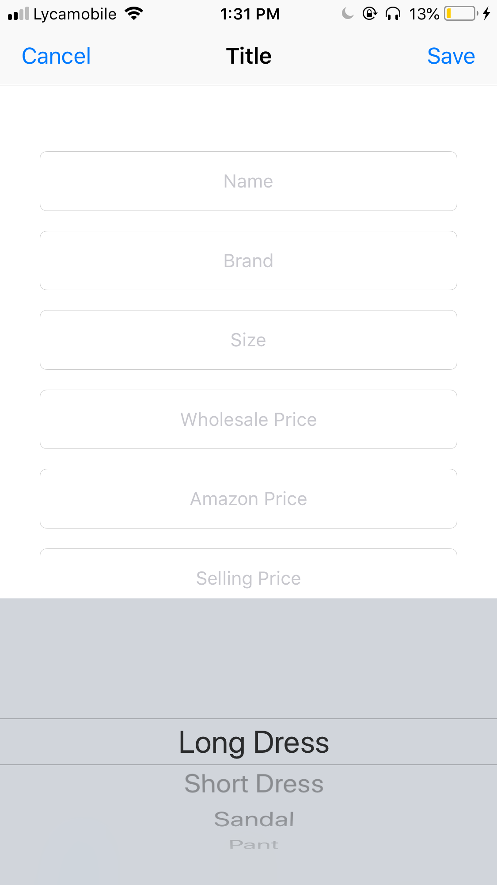

# TrackHub 
# CORE CONCEPT

TrackHub is an inventoy - based application that provides the client with key informations of their products based on the given inputs. Instead of writting a list of all of the business' products on a notebook and do the calculations by hands, TrackHub does all those tasks for you and you can access them right from your ios device! 

# Installation and Use
To use the app, you can:
  * Fork it and mess around with it
  * Clone it, and run it on xcode
  * Email me so I can add your device in the Beta version list of testers 
  
# AUTHOR 

* <i>Medi Assumani, Sole Software Engineer</i>  
* <i>Maceline Ambroise, The generator of the Idea and client of the app</i> 

# FEATURES

 * List of Products with name, image, and the profits dislayed on a tableview.
 * Synchronous information on projected profits made of all products based on provided data.
 * Synchronous information on the total amount invested on all products based on provided data.
 * "Add" button to give the user ability to log each products they have.
 * "Delete" slider to remove a product from the inventory.   

# TECHNOLOGY
 * Swift 4.0
 * CoreData
 * iOS 11
 * Xcode 9.0  

# IMPLEMENTATIONS

 * Developed the entire UI and connected them with the Swift Code.
 * Used UIKit's Tab Controller to structure the application better.
 * Implemented a UITableView to contain all the user's products.
 * Developed an Algorithm to calculate the total profits and total investment of all products.
 * Developed an Algorithm to calculate each profit made off a product.
 * I emplimented auto layout of each view controller in the app.
 * I emplimented the entire Core Data scheme and helper methods of the app to persist each product's data.  

# SCREENSHOTS

</img>
 

